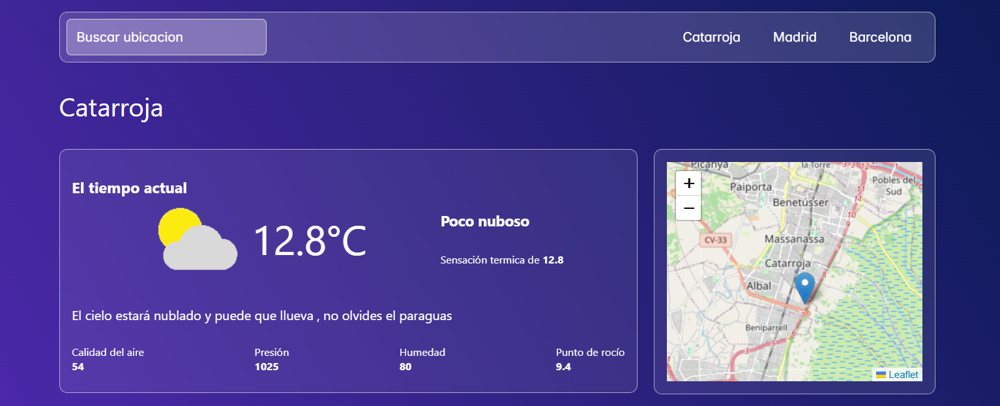
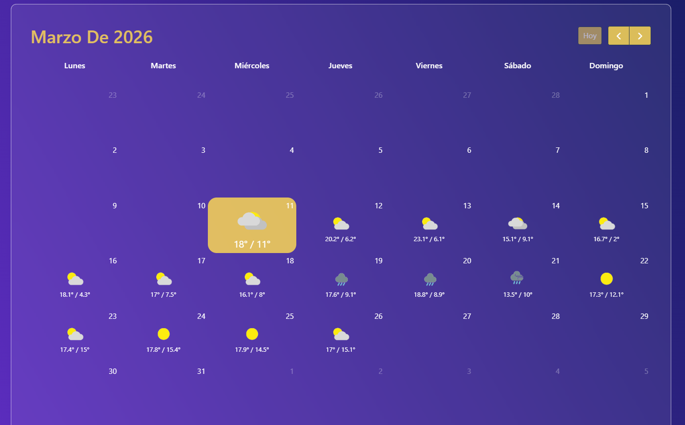

# 🌤 Weather Calendar App

Aplicación web desarrollada con **React** que permite consultar el **tiempo actual y la previsión meteorológica** de diferentes ciudades.

La aplicación muestra información detallada del clima y una **vista en calendario con la previsión de varios días**, utilizando librerías externas para mejorar la visualización de los datos.

---

## ✨ Qué puedes hacer en la aplicación

* 🌡 Consultar el **tiempo actual**
* 📅 Ver la **previsión meteorológica en formato calendario**
* 🔎 Buscar el clima de distintas **ciudades**
* 📍 Visualizar la ubicación en un **mapa interactivo**
* ☁ Ver **iconos dinámicos** según el estado del tiempo
* 🏙 Acceso rápido a ciudades como **Madrid, Barcelona o Catarroja**

---

## 🛠 Tecnologías utilizadas

Este proyecto utiliza:

* **React**
* **Create React App**
* **JavaScript**
* **CSS**
* **FullCalendar** → para mostrar la previsión en formato calendario
* **Leaflet** → para mostrar el mapa
* **Weatherbit API** → para obtener los datos meteorológicos

---

## 📋 Requisitos

Antes de ejecutar el proyecto asegúrate de tener instalado:

* **Node.js**
* **npm**

Puedes comprobarlo con:

```bash
node -v
npm -v
```

---

## ⚙️ Instalación

Clona el repositorio y después instala las dependencias:

```bash
npm install
```

---

## ▶️ Ejecutar el proyecto

Este proyecto fue creado con **Create React App**.

Para iniciar la aplicación en modo desarrollo ejecuta:

```bash
npm start
```

Después abre en el navegador:

```
http://localhost:3000
```

---

## 🌐 API utilizada

La aplicación utiliza la **Weatherbit API** para obtener los datos meteorológicos.

Ejemplo de petición utilizada en el proyecto:

```javascript
https://api.weatherbit.io/v2.0/current?city=${city},ES&key=${Key}&units=M&lang=es
```

Parámetros utilizados:

* `city` → ciudad a consultar
* `key` → **API Key necesaria para acceder a la API**
* `units=M` → unidades métricas
* `lang=es` → respuestas en español

---

## 🔑 Configuración de la API Key

Para poder ejecutar el proyecto necesitas una **API Key de Weatherbit**.

Pasos:

1. Crear una cuenta en
   https://www.weatherbit.io/

2. Obtener tu **API Key**

3. Añadir la clave en el archivo donde se realizan las peticiones a la API.

---

## 📷 Vista previa de la aplicación

### Tiempo actual y ubicación



### Calendario de previsión meteorológica



---


## 👨‍💻 Autor

Proyecto desarrollado como práctica utilizando **React y librerías externas para visualización de datos meteorológicos**.
